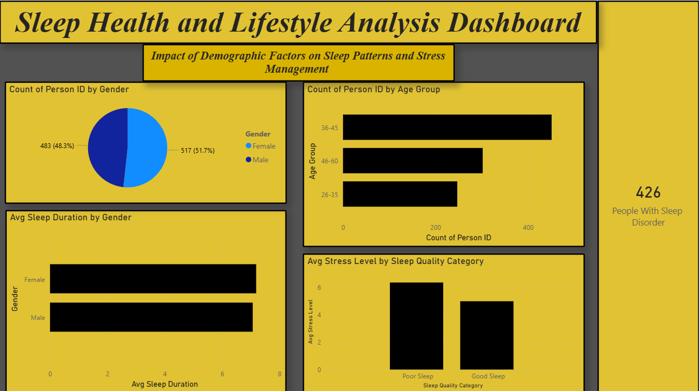
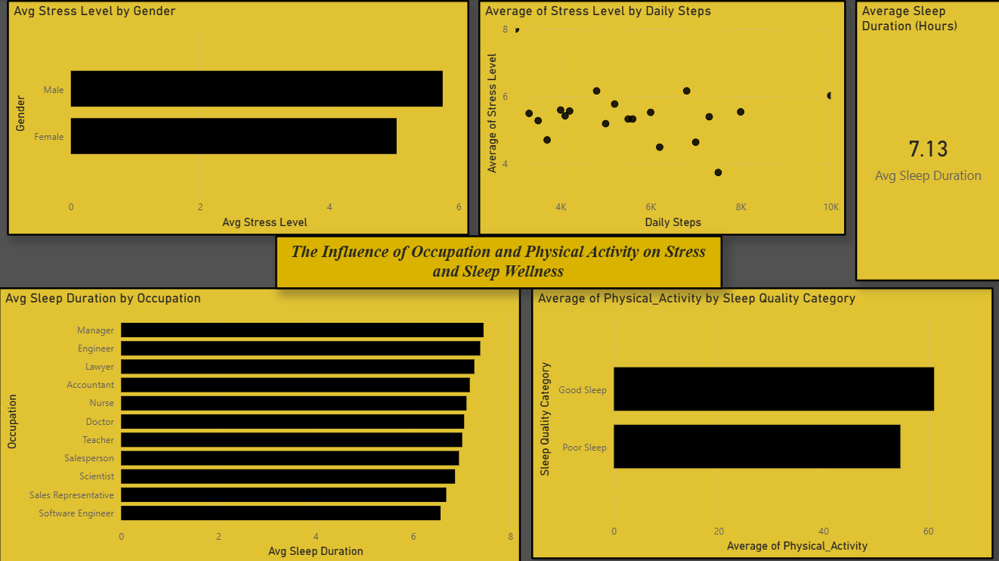
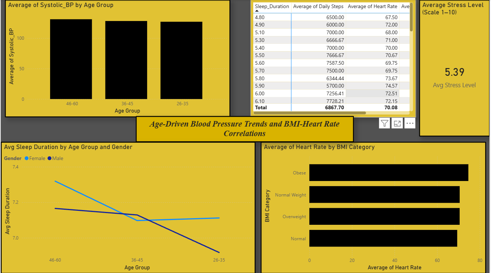
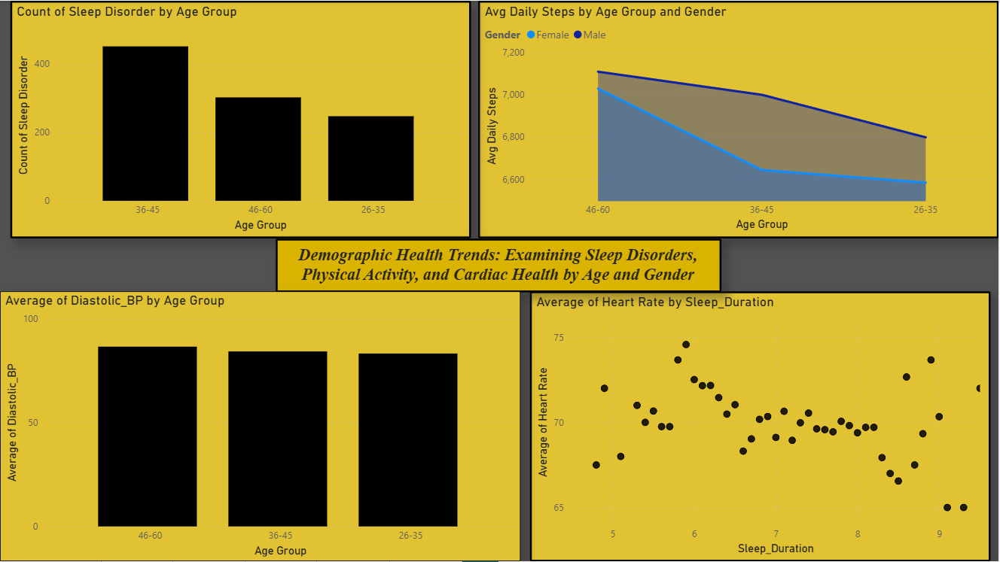
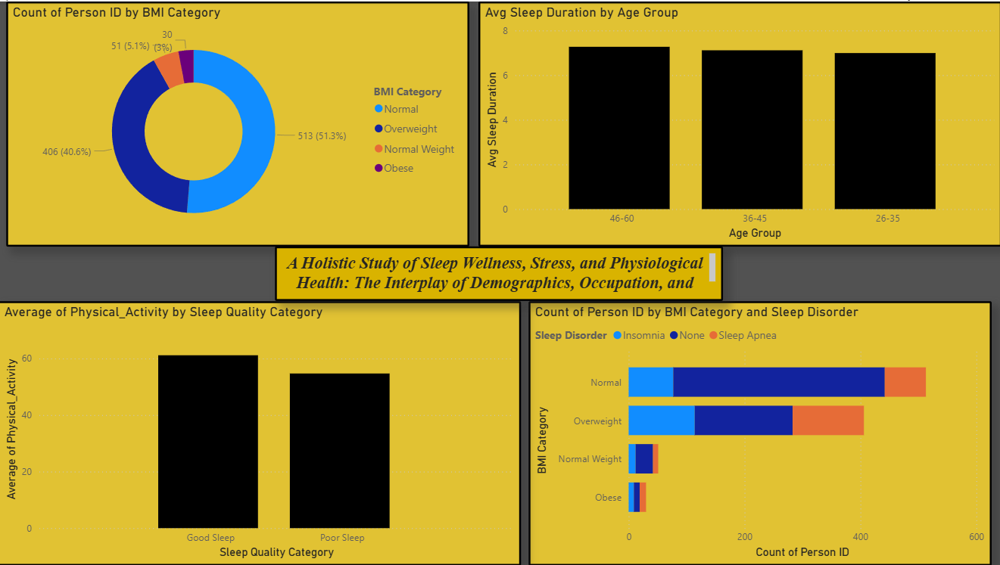

### Sleep Health and Lifestyle Analysis

**Author:** Paras Chaudhari

## Problem Statement
Understanding the complex relationship between our daily habits and our rest is crucial for overall well-being. The primary objective of this analysis is to understand how demographic factors and lifestyle behaviors influence sleep patterns, stress levels, and overall health outcomes using interactive Power BI visualizations. 

## Dataset
* **Source File:** Sleep_health_and_lifestyle_dataset.csv
* **Dimensions:** 1000 rows, 13 columns

## Solution
To address this, I developed an interactive Power BI dashboard that transforms raw health data into actionable insights. 
* **Data Transformation:** Added calculated columns such as Age Group, Sleep Quality Category, Systolic BP, and Diastolic BP to enhance analysis and visualization clarity.
* **Dynamic Calculations:** Created specific DAX measures including Average Sleep Duration, Average Stress Level, Average Daily Steps, Average Heart Rate, Total People, and Sleep Disorder Count to improve analytical accuracy.

## Key Insights Generated

### Demographics & Sleep Overview
* **Balanced Representation:** The study population is nearly equal, with females making up 51.7% and males 48.3%. 
* **Average Rest:** The population-wide average sleep duration is 7.13 hours.
* **Disorder Prevalence:** There are 426 individuals within the study population living with a sleep disorder, marking a significant health concern. The 36-45 age group shows the highest prevalence of these disorders.

### The Impact of Lifestyle & Occupation
* **Stress & Sleep Quality:** Individuals reporting "Poor Sleep" have significantly higher average stress levels (exceeding a score of 6) compared to those with "Good Sleep" (averaging a score of 5).
* **Physical Activity as Therapy:** Individuals with higher daily step counts (approaching 8k-10k steps) tend to report lower stress levels. Furthermore, those in the "Good Sleep" category engage in significantly higher levels of physical activity.
* **Career Impact:** Managers and Engineers report the highest average sleep durations, exceeding 7 hours. Conversely, Software Engineers and Sales Representatives report the lowest average sleep durations, falling below 7 hours.

### Physiological Correlations
* **Cardiovascular Health:** Systolic blood pressure gradually increases with age, with the 46-60 age group exhibiting the highest average values. 
* **BMI Factors:** Individuals in the Obese category have the highest average heart rate. Additionally, the Overweight group shows a much higher incidence of Insomnia and Sleep Apnea compared to the Normal weight group, while Obese individuals show a strong correlation with Sleep Apnea specifically.
* **Heart Rate & Rest:** Short sleep (4-6 hours) is associated with higher and more volatile heart rates, peaking near 75 bpm. Optimal sleep (7-8 hours) shows a stabilizing effect, lowering the average range to 68-70 bpm.

## Tools Used
* **Data Visualization:** Power BI 
* **Data Modeling:** DAX (Data Analysis Expressions) 

## Dashboard Screenshots

**Page 1**

---

**Page 2**

---

**Page 3**

---

**Page 4**

---

**Page 5**

